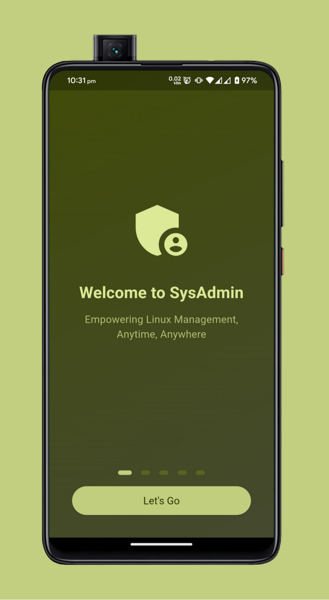
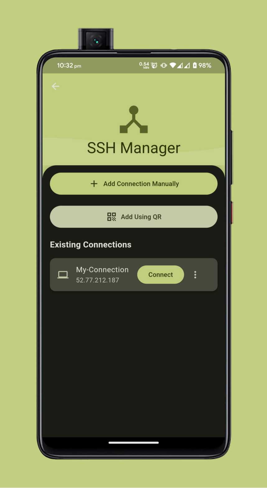
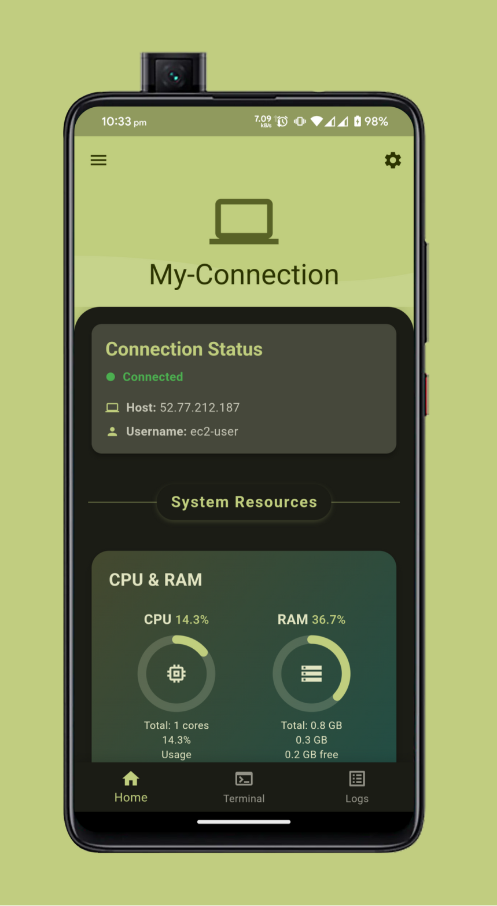

<div align="center">

# 🚀 Sys-Admin
### _Empowering Linux Management, Anytime, Anywhere_


[](https://flutter.dev/)
[](https://dart.dev/)
[](LICENSE)
[](https://github.com/yourusername/sys-admin/stargazers)

</div>

---

<div align="center">

🔐 **Secure** &nbsp;&nbsp;&nbsp;|&nbsp;&nbsp;&nbsp; 📊 **Efficient** &nbsp;&nbsp;&nbsp;|&nbsp;&nbsp;&nbsp; 📱 **Mobile-First** &nbsp;&nbsp;&nbsp;|&nbsp;&nbsp;&nbsp; 🌐 **Cross-Platform**

</div>

---

<br>

## 📌 Table of Contents
- [🚨 Important Notice](#-important-notice)
- [✨ Features](#-features)
- [🚀 Getting Started](#-getting-started)
- [📱 App Showcase](#-app-showcase)
- [🛠️ Tech Stack](#️-tech-stack)
- [🤝 Contributing](#-contributing)
- [📄 License](#-license)
- [📞 Contact](#-contact)
- [🙏 Acknowledgements](#-acknowledgements)

<br>

## 🚨 Important Notice

<div align="center">

```
⚠️ CRITICAL: Use Flutter version 3.22.2 for this project ⚠️
```

</div>

Due to a [known build issue in Dart 3.5.0](https://github.com/jonataslaw/get_cli/issues/263) related to `UnmodifiableUint8ListView`, we **strongly recommend** using Flutter 3.22.2 to ensure smooth development and building processes.

<details>
<summary><b>Click to expand: Flutter Version Setup</b></summary>

1. Check your current Flutter version:
   ```bash
   flutter --version
   ```
2. If not 3.22.2, downgrade using:
   ```bash
   flutter downgrade 3.22.2
   ```
3. Verify the change:
   ```bash
   flutter --version
   ```

</details>

We're actively monitoring the situation and will update the project once the issue is resolved in future Dart releases.

<br>

## ✨ Features

<div align="center">

| Feature | Description |
|---------|-------------|
| 🔐 **SSH Manager** | Securely connect and manage multiple servers |
| 👥 **User Administration** | Effortlessly manage user accounts |
| 👥 **Group Administration** | Streamline group management tasks |
| 📊 **Logs Monitor** | Real-time log analysis and alerting |
| 📈 **Resource Monitoring** | Track CPU, memory, and disk usage |
| 🛡️ **Network Security** | Robust encryption and multi-factor authentication |
| 💻 **Terminal Provider** | Full-featured terminal emulator in your pocket |

</div>

<br>

## 🚀 Getting Started

### Prerequisites

- Flutter SDK (version 3.22.2)
- Dart SDK (3.4.0)
- Android Studio or VS Code with Flutter extensions

### Installation

<details>
<summary><b>Click to expand: Step-by-step guide</b></summary>

1. Clone the repository:
   ```bash
   git clone https://github.com/yourusername/sys-admin.git
   ```

2. Navigate to the project directory:
   ```bash
   cd sys-admin
   ```

3. Install dependencies:
   ```bash
   flutter pub get
   ```

4. Run the app:
   ```bash
   flutter run
   ```

</details>

<br>

## 📱 App Showcase

<div align="center">

| Welcome page | SSH Manager | Home Screen |
|:-----------:|:-------------------:|:-------------------:|
|  |  |  |


</div>

<br>

## 🛠️ Tech Stack

<div align="center">

| Technology | Purpose |
|------------|---------|
| Flutter 3.22.2 | Cross-platform UI toolkit |
| Dart 3.4.0 | Programming language |
| Provider | State management |
| flutter_secure_storage | Secure data storage |
| dartssh2 | SSH client implementation |
| dynamic_color | Dynamic theming |
| Google Fonts | Typography |
| connectivity_plus | Network connectivity |

</div>

<br>

## 🤝 Contributing

We welcome contributions to Sys-Admin! Let's make server management better together.

<details>
<summary><b>Click to expand: Contribution Guidelines</b></summary>

1. Fork the Project
2. Create your Feature Branch (`git checkout -b feature/AmazingFeature`)
3. Commit your Changes (`git commit -m 'Add some AmazingFeature'`)
4. Push to the Branch (`git push origin feature/AmazingFeature`)
5. Open a Pull Request

**Note**: Remember to use Flutter 3.22.2 when setting up your development environment for this project.

</details>

<br>

## 📄 License

Distributed under the MIT License. See [`LICENSE`](LICENSE) for more information.

<br>

## 📞 Contact

Maintained by  - Atharv Hiremath  [ Neutrino79 ]

Project Link: https://github.com/Neutrino79/SysAdmin

<br>

## 🙏 Acknowledgements

- [Flutter](https://flutter.dev/)
- [Dart](https://dart.dev/)
- [dartssh2](https://pub.dev/packages/dartssh2)
- [flutter_secure_storage](https://pub.dev/packages/flutter_secure_storage)
- [dynamic_color](https://pub.dev/packages/dynamic_color)
- [Google Fonts](https://pub.dev/packages/google_fonts)

<br>

<div align="center">

<p>Made with ❤️ by Neutrino79</p>

<p>
  <a href="https://flutter.dev" target="_blank">
    
  </a>
  &nbsp;&nbsp;
  <a href="https://dart.dev" target="_blank">
    
  </a>
</p>

</div>

